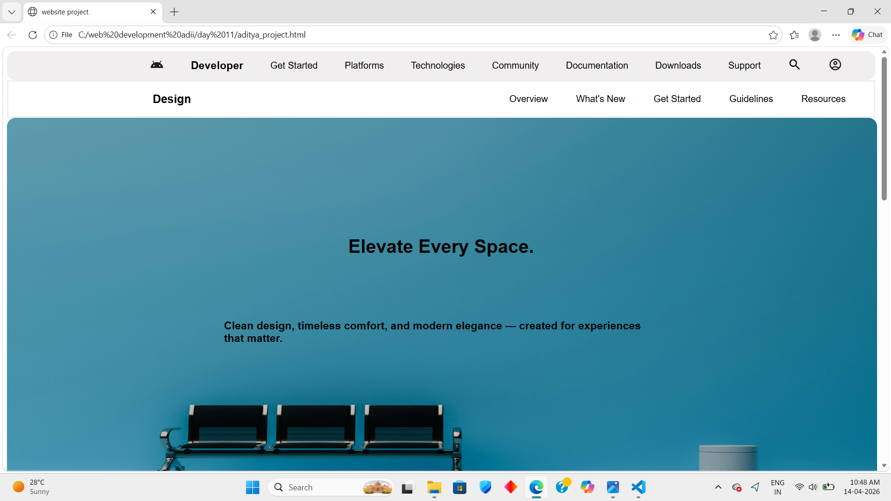

# Modern Design Website

A responsive website built using HTML and CSS, featuring a clean user interface, interactive elements, and a modern design approach.

## ✨ Features

- Responsive layout for different screen sizes
- Interactive profile sidebar
- Hover animations and transitions
- Card-based content sections
- Modern navigation design
- Mobile-friendly experience

## 🛠️ Technologies Used

- HTML5
- CSS3
- Flexbox
- Media Queries

## 📸 Project Preview

## 📸 Project Preview

### Homepage

### Cards Section

### Navigation Bar

### Responsive Website

## 👨‍💻 Author

Aditya
